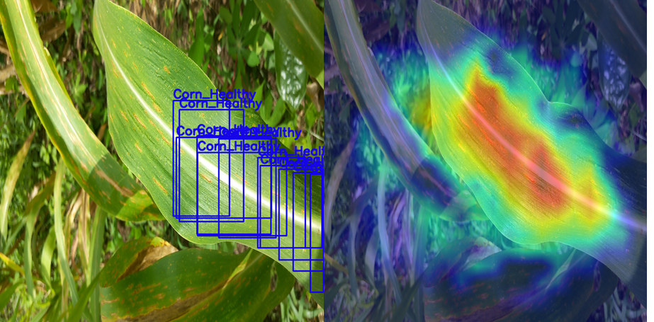
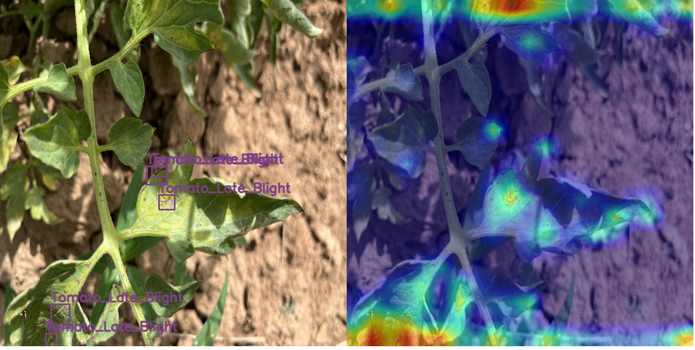

# [Ghana Crop Disease Detection Challenge Solution](https://zindi.africa/competitions/ghana-crop-disease-detection-challenge)
We present our solution for the Ghana Crop Disease Detection Challenge Solution on Zindi, currently placed 7th Place

## Model Summary

The solution was an ensemble of two RT-DETR [(Realtime Detection Transformer)](https://docs.ultralytics.com/models/rtdetr/#how-does-rt-detr-support-adaptable-inference-speed-for-different-real-time-applications) models using ultralytics framework. One model is trained from a 20 fold split and the other from a 24 fold split. The models are ensembled using [Weighted boxes fusion (WBF)](https://learnopencv.com/weighted-boxes-fusion/)

## TRAINING DETAILS
 ⚡ **Training Notebook**  
 The model is trained on one T4 GPU.  
Training Time: **0.094 per epoch** (8.8 hours total).  
  
📌 **[View the Kaggle Training Notebook Here](https://www.kaggle.com/code/sitwala/ghana-crop-detection-stigen/log?scriptVersionId=213461275)**.


## Dependencies
```
ultralytics==8.3.39
torch==2.4.0
ensemble_boxes
```
## Code Usage
```bash
git clone https://github.com/SitwalaM/ghana_crop_zindi_challenge_stigen.git
cd ./ghana_crop_zindi_challenge_stigen
```
make sure Z_IMAGE_PARENT in [reproduce.sh](https://github.com/SitwalaM/ghana_crop_zindi_challenge_stigen/blob/main/scripts/reproduce.sh) points to the parent directory of the images
The Training can be run and will produce the submission file:
```bash
bash ./scripts/reproduce.sh
```

## ONNX EXPORT
dependency: onnx>=1.12.0
```python
# Load the model and export it to ONNX format
path_to_weights = 'path/to/weights/best.pt'
model = RTDETR(path_to_weights)
model.export(format="onnx")
```
## Explainability with Grad-CAM

To better understand the model's predictions, Grad-CAM was applied to visualize the regions contributing most to the classification and detection of objects.

### Healthy Corn Leaf
The left image shows the object detection predictions, while the right image highlights the areas the model focused on (via Grad-CAM).



### Tomato Leaf Blight
The left image shows the detected regions for "Tomato Late Blight," and the right image demonstrates Grad-CAM visualizations pinpointing the critical areas.




## Authors
1. [ngoym](https://github.com/ngoym)
2. [sitwalam](https://github.com/SitwalaM)
